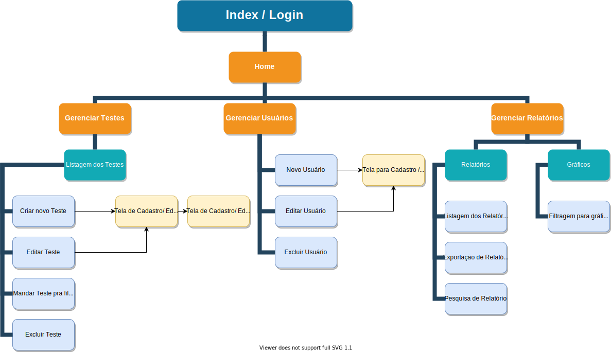

# Frontend Testes E2E

Created: Apr 14, 2021 11:27 AM
Created By: João Siles
Last Edited By: João Siles
Last Edited Time: Apr 15, 2021 2:40 PM
Property: Via Varejo
Stakeholders: Leticia Pastrelo
Status: In Progress 🙌
Type: Technical Spec

# Descrição

Documento da stack de frontend do projeto de Automação de Testes E2E produzido pela equipe da POC3 da Via Varejo. O objetivo é apresentar as telas e fluxo UX do projeto.

# Estrutura de Navegação

### Seções



[Index / Login](docs/Index.md)

- [Home](docs/Index/Home.md)
- [Gerenciar Testes](docs/Index/Home/GerenciarTestes.md)
- [Gerenciar Usuários](docs/Index/Home/GerenciarUsuarios.md)
- [Gerenciar Relatórios](docs/Index/Home/GerenciarRelatorios.md)

### Instalação

- O projeto de Frontend é feito no framework Quasar utilizando o Vue.js e sua instalação é feita da seguinte maneira após clonar o repositório:
1. Clone o repositório de *docker-builder* para utilizar as dependências em uma imagem Docker
2. Acesse o diretório *docker-builder* e execute a inicialização das imagens através do comando:

```bash
cd docker-builder
docker-composer up -d
```

3. No seu computador edite o arquivo de *hosts* adicionando as seguintes linhas:

```bash
127.0.0.1 api.e2e.local
127.0.0.1 dashboard.e2e.local
127.0.0.1 mongoclient.e2e.local
```

- As linhas acima especificam os caminhos na ordem de *API*, *Front* e *Banco de Dados*.

4.  Acesse a seguinte URL no navegador para utilizar o projeto:

```bash
http://dashboard.e2e.local:8080/
```
