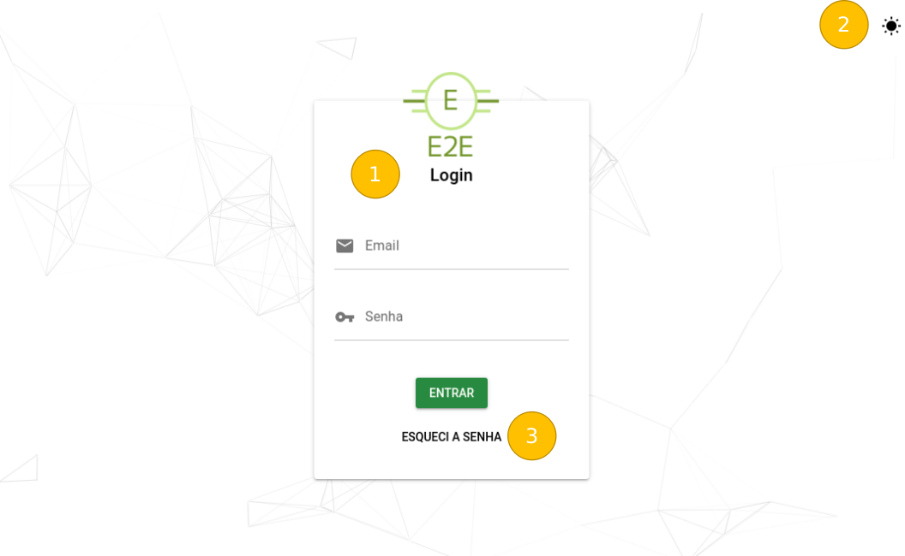

# Index / Login

Modo Claro:

Modo Escuro:

### 1 - Área de Login

- Área onde é inserido o *email* e *senha* do usuário.
- Botão *Entrar* para logar no sistema

### 2 - Ativar / Desativar Modo Escuro

- Botão que ativa e desativa o modo escuro do site. O ícone muda conforme o modo escolhido.

### 3 - Esqueci a Senha

- Ao clicar no botão *Esqueci a Senha* é aberto um modal (3.1) nforme a imagem a seguir:

- No caso do *email* inserido for inválido é apresentado um modal de erro (3.1.1)

- Agora caso o sistema tenha o *email* cadastro em sua base é apresentado um modal de sucesso (3.1.2) e encaminhado uma mensagem com os devidos procedimentos.

### Após o login realizado com sucesso podemos navegar nas seguintes páginas:

[Home](Index/Home.md)

### Features desta tela

- Foi utilizada a lib **particles.js^2.0.0** para criar o efeito de partículas flutuantes no background;
- Para os modais foi aplicada a lib **sweetalert2^4.2.0**
