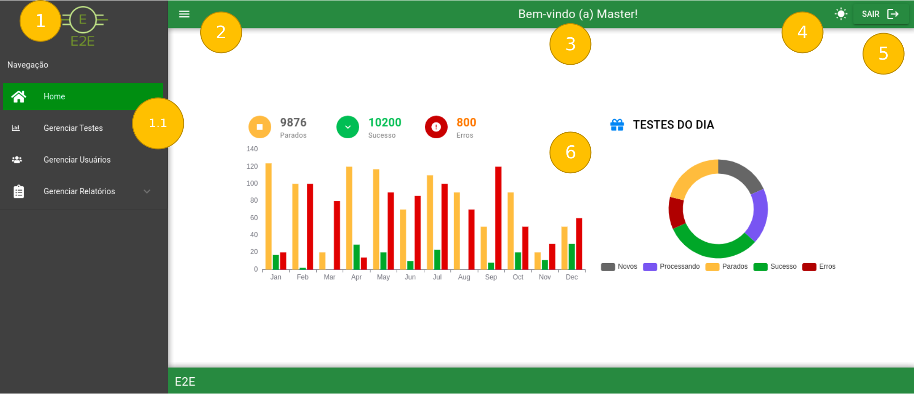

# Home

Após realizar o *login* o usuário é redirecionado para a *Home.*

Modo Claro:

Modo Escuro:

### 1 - Menu Lateral

- Menu contendo opções de navegação para seções da aplicação.

1.1 - Opções do menu

- Áreas da aplicação que podem ou não ser expandidas revelando sub-áreas das seções da aplicação.

### 2 - Botão de recolher/exibir o menu lateral

- Botão que recolhe/exibe o *Menu Lateral* (1)

### 3 - Heading de Boas Vindas

- Exibe mensagem de Boas Vindas junto ao nome do usuário.

### 4 - Botão Modo Escuro

- Botão que ativa e desativa o modo escuro do site. O ícone muda conforme o modo escolhido.

### 5 - Botão Sair

- Botão de logout que redireciona para a [Index/Login](../Index.md)

### 6 - Conteúdo de boas-vindas

- Gráfico que exibe informações básicas sobre o projeto / testes

### Após o login realizado com sucesso podemos navegar nas seguintes páginas:

[Gerenciar Testes](Home/GerenciarTestes.md)

[Gerenciar Usuários](Home/GerenciarUsuarios.md)

[Gerenciar Relatórios](Home/GerenciarRelatorios.md)

### Features desta tela

- Foi utilizada a lib de *material design* do Google para os ícones.
