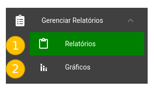

# Gerenciar Relatórios

Ao clicar em *Gerenciar Relatórios* é aberto um sub-menu com duas opções:

### 1 - Relatórios

- Leva o usuário a tela de [Relatórios](GerenciarRelatorios/Relatorios.md)

### 2 - Gráficos

- Leva o usuário a tela de [Gráficos](GerenciarRelatorios/Graficos.md)

### Telas navegáveis a partir desse ponto:

[Relatórios](GerenciarRelatorios/Relatorios.md)

[Gráficos](GerenciarRelatorios/Graficos.md)
