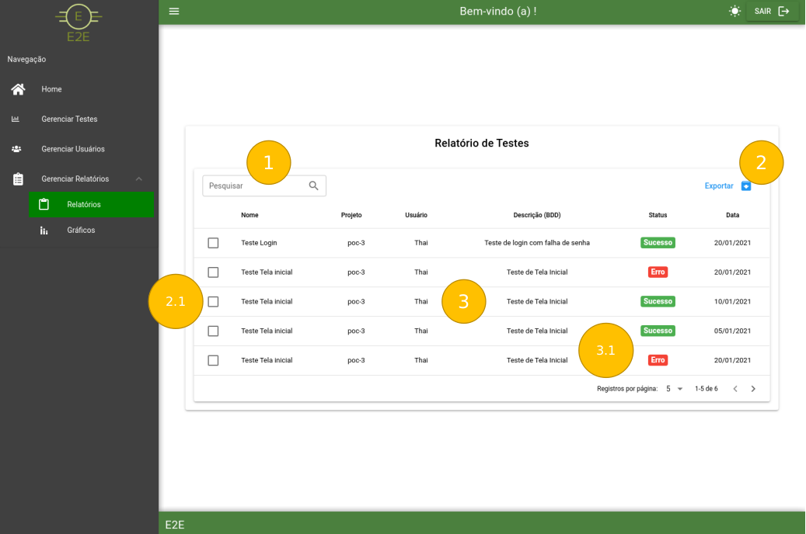

# Relatórios

Ao clicar na opção de *Relatórios* você é direcionado pra seguinte página:

Modo Claro:

Modo Escuro:

### 1 - Pesquisa de Relatórios

- A pesquisa pode ser realizada através de *Nome, Projeto, Usuário* e *Descrição do BDD.*

### 2 - Botão de exportação de relatórios

- Botão para exportar todos ou uma seleção de relatórios (clicando no item 2.1) para o formato *.csv*.

### 3 - Grid de exibição

- Exibição dos dados filtrados ou não através de *Nome, Projeto, Usuário, Descrição do BDD e Status* (item 3.1) que podem ser os seguintes: **

