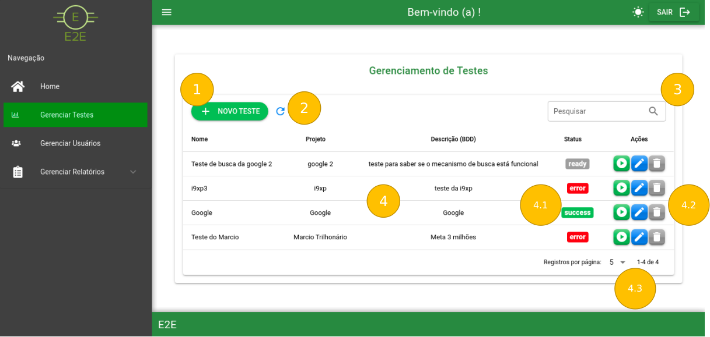

# Gerenciar Testes

Ao clicar em *Gerenciar Testes* você é direcionado a seguinte página:

Modo Claro:

Modo Escuro:

### 1 - Botão para cadastrar um Novo Teste

- Ao clicar nesse botão o usuário é redirecionado para a página de [cadastro de testes](GerenciarTestes/CadastroEdicaodeTestes.md).

### 2 - Botão atualizar

- Ao clicar nesse botão é atualizado o grid de testes fazendo uma nova consulta no banco de dados.

### 3 - Pesquisa de testes

- Pesquisa de testes através de nome, projeto ou descrição (WIP).

### 4 - Grid de testes

- Lista os testes cadastrados através de Nome, Projeto, Descrição (BDD), Status (fila) e Ações de teste.

4.1 - Status

Os testes cadastrados são listados em status de acordo com sua ordem de execução na fila, cadastro ou finalização com as seguintes etiquetas:

4.2 - Ações

1. *Botão para executar o teste*
2. *Botão para abrir a edição de teste*
3. *Botão para excluir o teste*

Ao executar um teste é apresentado o seguinte modal:

1. *Modal de confirmação para execução do teste*

2.  *Modal com mensagem de sucesso após confirmação de execução.*

4.3 - Paginação onde é escolhida a quantidade de testes a ser exibidos no grid

### Após o login realizado com sucesso podemos navegar nas seguintes páginas:

[Cadastro / Edição de Teste](GerenciarTestes/CadastroEdicaodeTestes.md)

[Home](../Home.md)
