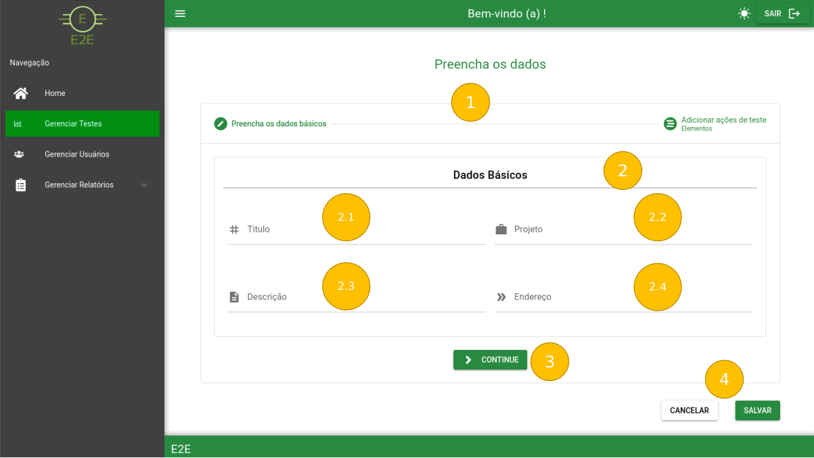

# Cadastro / Edição de Testes

Tela para cadastro ou edição de testes em duas etepas.

### Etapa 1

Modo Claro:

Modo Escuro:

### 1 - Breadcrumb das etapas de cadastro / edição

- A timeline demonstra em qual etapa estamos no [cadastro / edição](../GerenciarTestes.md)

### 2 - Dados básicos de cadastro do teste

- Nos dados de cadastro de teste temos os seguintes campos:

    2.1 - Titulo do Teste

    2.2 - Projeto ao qual o Teste pertence

    2.3 - Descrição do Teste

    2.4 - URL a ser acessada para efetuar o teste

### 3 - Botão para avançar na etapa de cadastro / edição

### 4 - Botão para salvar o teste cadastrado

### Etapa 2

### 1 - Breadcrumb das etapas de cadastro / edição

- A timeline demonstra em qual etapa estamos no cadastro / edição

### 2 - Tipos de Operação

- Ao clicar no caixa de seleção são exibidas as seguintes opções:

### 3 - Parâmetro da Operação

- Ao clicar no caixa de seleção são exibidas as seguintes opções:

### 4 - Campos de preenchimento

- Campos para preencher após a escolha do tipo e parâmetro de operação.

### 5 - Botão para adicionar a ação

- A ação adicionada será exibida em Código Gerado e Elementos de Teste

### 6 - Código Gerado

- Prévia de código similar ao que será gerado para o script de testes no backend

### 7 - Elementos de Teste

- Similar ao código gerado aqui ficam dispostos os elementos cadastrados com botões de ação para edição (7.1) e exclusão (7.2)
- Ao clicar no botão de edição é aberto um modal com um campo para edição (7.1.1) e botões de fechar ou ok (7.1.2)

Ao clicar para salvar o teste é exibido o seguinte modal com as opções de cadastrar (1) e cancelar:

### Ao efetuar o cadastro é exibido o seguinte modal:

### Ao editar o teste o seguinte modal é exibido:

### Caso haja algum erro no cadastro / edição o modal de erro é exibido:

