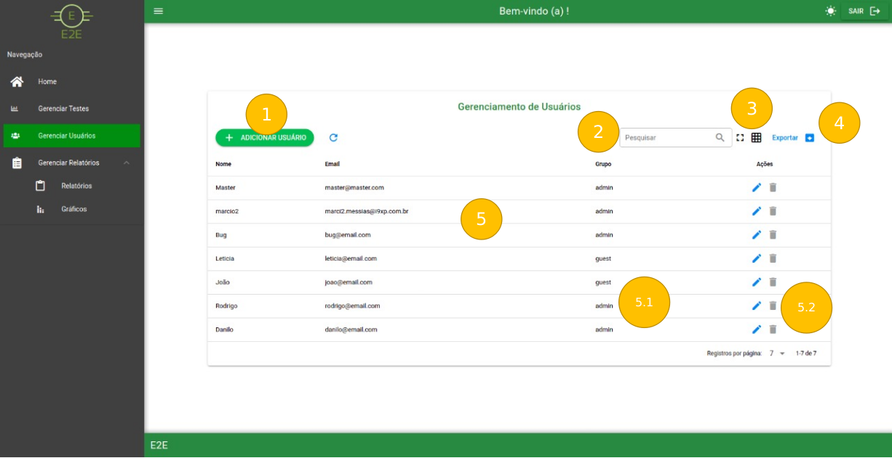

# Gerenciar Usuários

Ao clicar em *Gerenciar Usuários* o usuário será redirecionado pra seguinte tela:

Modo Claro:

Modo Escuro:

### 1 - Botão Adicionar Usuário

- Ao clicar nesse botão o usuário é redirecionado pra tela de cadastro

### 2 - Área de Pesquisa de Usuários

- Aqui é realizado o input de dados para busca de usuários através de *nome* ou *email*

### 3 - Modo de Exibição do Grid

- Por padrão é exibido o modo lista, mas ao clicar nos botões é possível alternar entre o modos de exibição:

**Tela Cheia:**

    3.1 - Alternar para modo tela normal

**Modo Grid:**

   3.2 - Botão para voltar ao Modo Lista

   3.3 - Cards do Modo Grid

      3.3.1 - Botão de editar usuário
      3.3.2 - Botão de excluir usuário

### 4 - Exportar usuários

- Exporta uma lista de usuários do sistema para o formato *.csv*

### 5 - Grid de Usuários

- Aqui ficam listados os usuários através de *Nome* e *Email*

       5.1 - Exibe etiquetas que demonstram se aquele usuário possui poderes administrativos ou não do sistema.

      5.2 - Botões de ação do registro de usuário

  1 - Abre a tela de [Cadastro / Edição do Usuário](GerenciarUsuarios/CadastroEdicaoDeUsuarios.md)

  2 - Exclui o registro selecionado

### Após o login realizado com sucesso podemos navegar nas seguintes páginas:

[Cadastro / Edição de Usuários](GerenciarUsuarios/CadastroEdicaoDeUsuarios.md)
