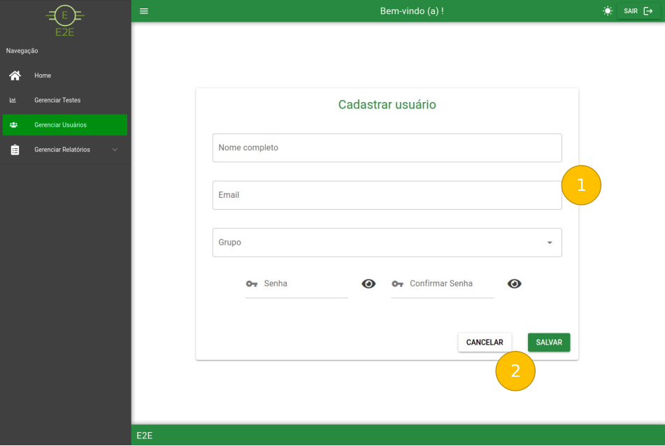

# Cadastro / Edição de Usuários

Ao clicar no botão de *Adicionar Usuário* somos redirecionados pra seguinte tela:

Modo Claro:

Modo Escuro:

### 1 - Campos de Cadastro

- No sistema o usuário é cadastrado utilizando como dados *Nome Completo*, *Email institucional* e *Grupo* sendo esse último relacionado a níveis de acesso que atualmente se dividem em:

### 2 - Botões de Ação

- Pode-se cancelar o cadastro ou confirmar. Ao confirmar são exibidos os seguintes modais:

**Modal de Cadastro**:

**Modal de Atualização (Edição):**

    1 - Confirma ou cancela a ação de cadastro / edição. Caso seja confirmado podem ser exibidos os seguintes modais:

**Modal de Sucesso Cadastro:**

**Modal de Sucesso Alteração (Edição):**

**Modal de Erro:**

Ao final das operações de cadastro ou edição o usuário será redirecionado para a tela de [Gerenciar Usuários](../GerenciarUsuarios.md).
